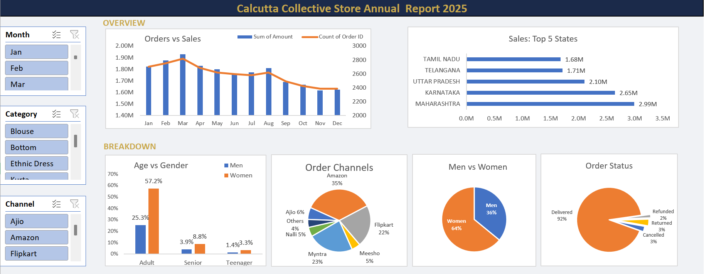

# 📊 Excel Sales Dashboard — Calcutta Collective Store (2025)

An interactive annual sales dashboard built entirely in **Microsoft Excel**, covering the full data workflow — from raw data cleaning and processing to pivot-based analysis and a dynamic visual report.



---

## 🛠️ Tools & Features

- **Microsoft Excel 2021**
- Pivot Tables & Pivot Charts
- Interactive Slicers (Month, Category, Channel)
- Data Cleaning & Transformation
- 6 Dynamic Charts across 2 dashboard rows

---

## 📁 Repository Structure

```
excel-sales-dashboard/
│
├── data/
│   └── raw_data.xlsx              ← original unmodified dataset
│
├── Calcutta_Collective_2025.xlsx  ← main workbook (modified table
│                                     + pivots + dashboard)
│
├── preview/
│   └── report.png                 ← screenshot of report sheet
│
└── README.md
```

---

## 📋 Workbook Sheets

| Sheet | Description |
|---|---|
| Store Report 2025 | Interactive dashboard with 6 charts and 3 slicers |
| Modified Data | Cleaned and processed data table used for analysis |
| Pivot 1–6 | Individual pivot tables backing each chart |

---

## 📈 Dashboard Charts

**Overview Row**
- **Orders vs Sales** — combo line + bar chart tracking monthly revenue (Sum of Amount) and order volume (Count of Order ID) across all 12 months
- **Sales: Top 5 States** — horizontal bar chart comparing revenue across Maharashtra, Karnataka, Uttar Pradesh, Telangana, and Tamil Nadu

**Breakdown Row**
- **Age vs Gender** — grouped bar chart showing order distribution across Adult, Senior, and Teenager segments by gender
- **Order Channel** — pie chart showing platform-wise order split across Amazon, Flipkart, Myntra, Meesho, Ajio, Nalli, and others
- **Men vs Women** — pie chart showing overall gender split in orders
- **Order Status** — pie chart showing fulfillment outcomes (Delivered, Returned, Refunded, Cancelled)

---

## 📊 Key Insights

- **Women drive 64% of orders** — significantly outpacing men across all channels and age groups
- **Adult segment (30–49 yrs) contributes ~50% of orders** — the dominant customer demographic for both genders
- **Maharashtra is the top state** at ₹2.99M in sales, followed by Karnataka (₹2.65M) and Uttar Pradesh (₹2.10M)
- **Amazon leads all channels at 35%**, with Myntra (23%) and Flipkart (22%) together accounting for nearly half of remaining orders
- **92% of orders are successfully delivered** — very low return (3%), refund (2%), and cancellation (3%) rates
- **Peak sales month is March** — orders and revenue both spike mid-Q1, then decline steadily through year-end

---

## ✅ Recommendation

Target **women aged 30–49** in **Maharashtra, Karnataka, and Uttar Pradesh** through promotional ads, offers, and coupons on **Amazon, Flipkart, and Myntra** for maximum sales conversion.

---

## 🚀 How to Use

1. Download `Calcutta_Collective_2025.xlsx`
2. Open in Microsoft Excel 2021 or later
3. Navigate to the **Store Report 2025** sheet
4. Use the slicers on the left (Month / Category / Channel) to filter all charts dynamically
